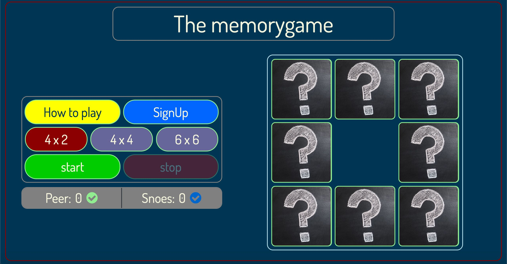
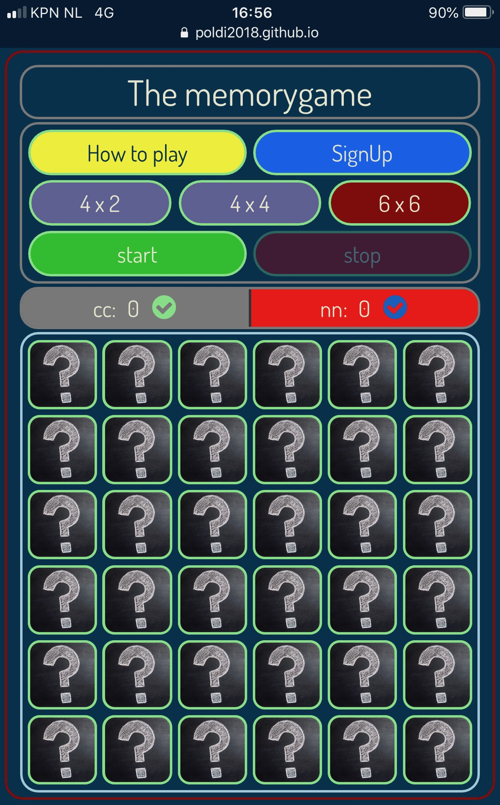
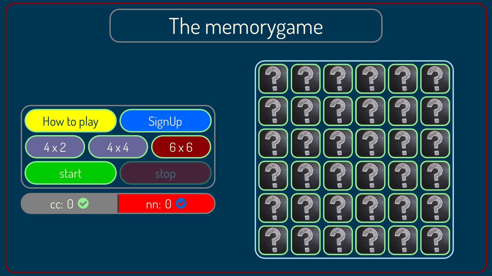
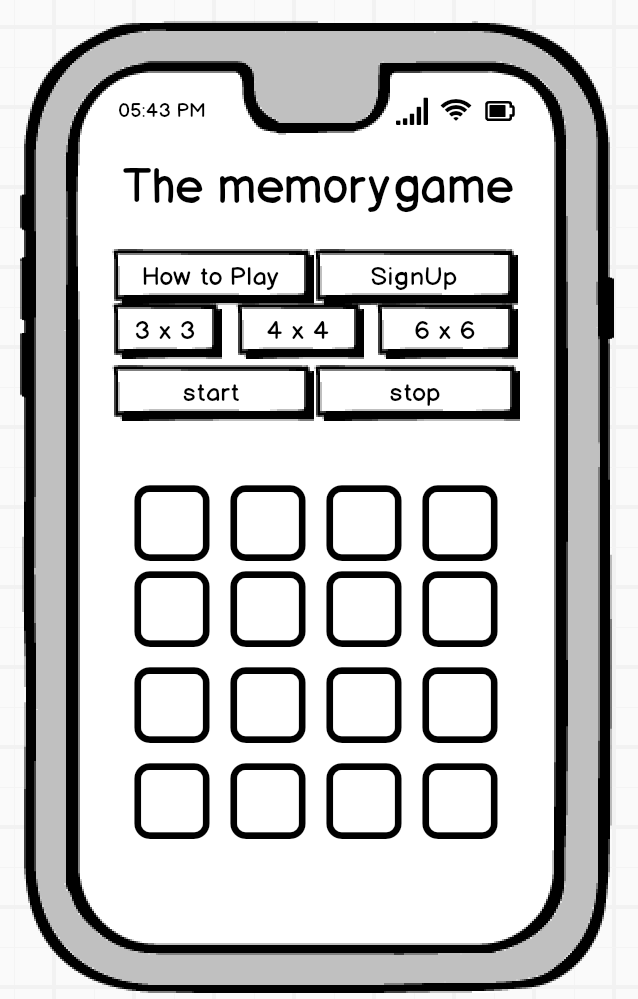
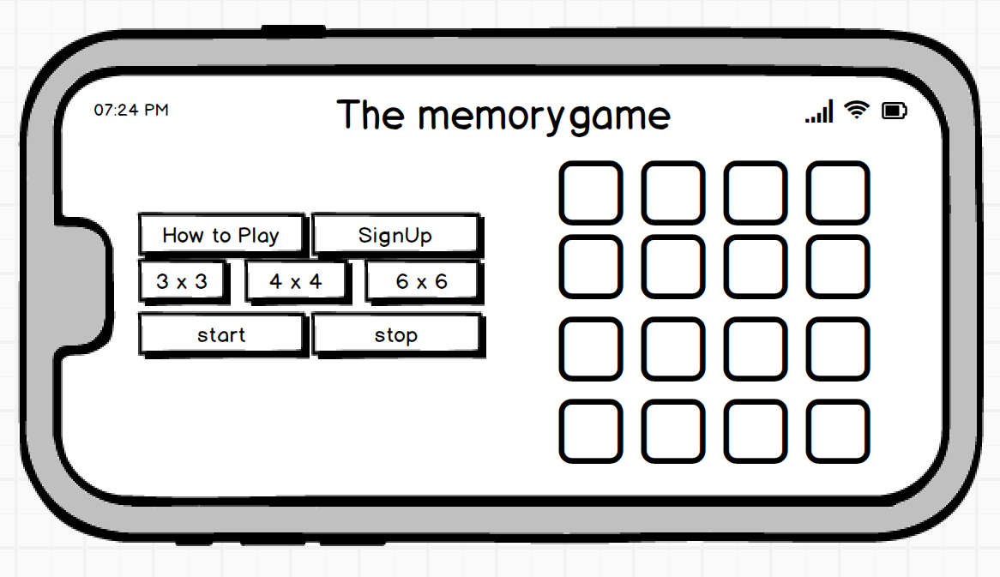
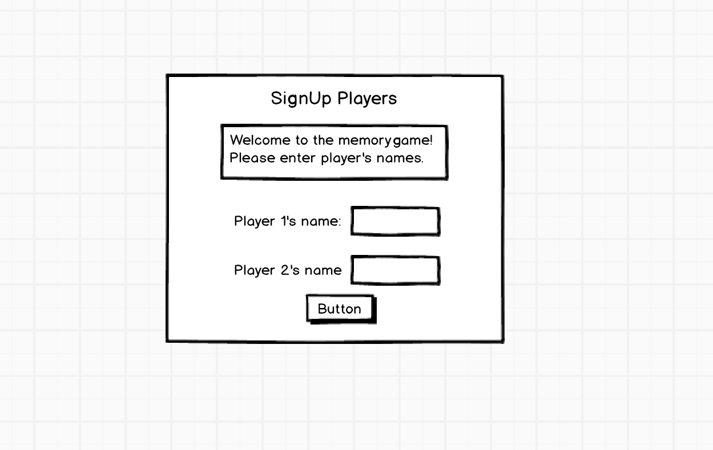
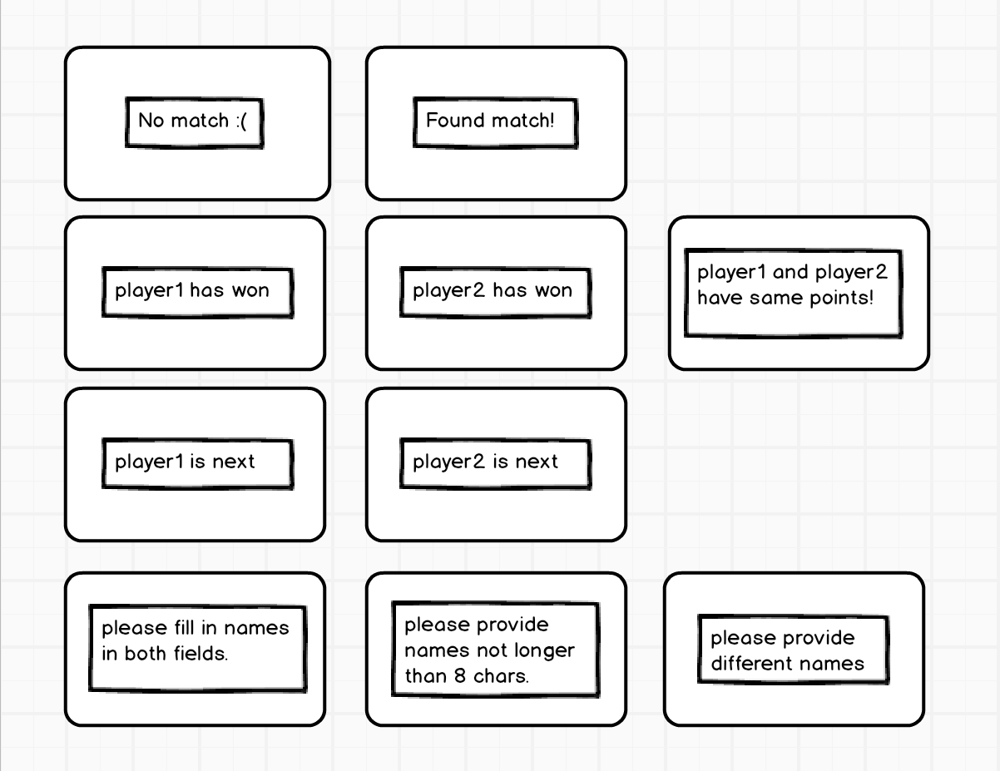
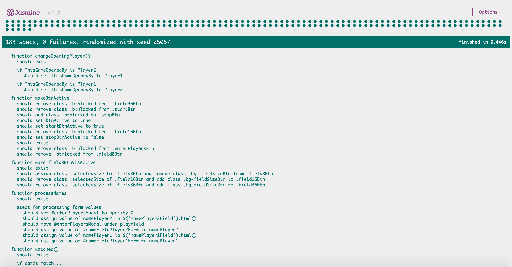

<h1> Introduction of The memory game </h1>

This classic memory card game is intended to be played by two players. It serves to train memory skills and can be played by all ages.
It is a demonstration of different techniques I have tried and tested very well in depth during practical research, such as HTML 5.0, CSS 3, JQUERY and JAVASCRIPT.

<em><b> Livelink: <a href="https://poldi2018.github.io/Milestone2-Interactive-Frontend/" target="_blank">https://poldi2018.github.io/Milestone2-Interactive-Frontend/</a></b></em>

<h1> Screenshots </h1>

<h2> Desktop version </h2>

<h3> Mobile version, portrait </h3>

<h3> Mobile version, landscape </h3>

<h1> UX </h1>

<h2> Userstories </h2>

As a user, I want to test my memory skills and play against another player to have a competition.
The game should be loaded quickly, provide an easy to understand layout and rules to play. It should allow quick matches. The user interface and controls should provide a good look and feel experience. 

<h2> Wireframes </h2>

<h3> Mobile version, portrait </h3>

<h3> Mobile version, landscape </h3>

<h3> SignUp dialog </h3>

<h3> popups </h3>

The difference between mobile and desktop landscape are some changes in fontsize and altering the proportions of div containers so they are wrapped correctly by flexbox.

So the space in landscape is basically divided into a section for controlpanel and one for the playfield, each using roughly 50% of screen.

In portrait mode, the control and playfield are stacked up and fit nicely in viewport. No scrolling involved.

The target was to cover all mobile and desktop sizes. To achieve this I have created 4 breakpoints. Two for aspect ration 1.77 (nearly all mobile devices, portrait and landscape mode) and two for aspect ratio 1.33 (ipad and ipad pro, portrait and landscape mode).

<h1> Current features </h1>

<h2> Remarks on controlpanel </h2>

<h3> ‘How to’ button</h3>

To display game rules. It initially called a bootstrap modal to inform about the rules which was then replaced by custom popup

<h3> ‘SignUp’ button </h3>

To display signup dialog. This dialog is displayed on startup. I moved away from bootstrap modal and created an extra popup. But it was good for future projects to practice using the bootstrap modal. The fields to enter player’s name is being validated when the user pushes the save button. Entered names are checked against minimum string length (no empty fields allowed), maximum string length (max. 8 chars) and different names (this checkup could be removed, as duplicate names is not a problem for game engine anymore)

<h3> ‘4 x 2’ button </h3>
To select 4 x 2 playfield, 8-cards

<h3> ‘4 x 4’ button </h3>

To select 4 x 4 playfield, 16-cards

<h3> ‘6 x 6’ button </h3>

To select 6 x 6 playfield, 36-cards

<h3> ‘start’ button </h3>

To start a game.

<h3> ‘stop’ button </h3>

To stop or pause a game

<h2> Remarks on playfield </h2>

To make the cards turn smoothly I decided to use the transform-style: preserve-3d; option in CSS, as the option backface-visibility did not make them turn nicely and had some flickering issue. So I used two cards - one front and one backside, each 1px difference on z-scale.
The mechanism to disable the playfield / cards right after two cards have been clicked, works very well even when clicked excessively.   

<h1> Features Left to Implement </h1>

A single player mode
different decks of cards
a version which cannot be cheated, as currently one could just call the DOM structure and check where matching cards are located. But this way it was convenient to test the game efficiently.
future single player mode with popups removed

<h1> Technologies Used </h1>

The entire game engine is written in JavaScript. In combination with JQuery it was quite convenient to alter DOM elements and CSS  properties in its values and generate card elements on the fly.

Beside of course HTML for the structure and CSS for applying optical styles, I used fontawesome for player’s checkmark icon. 

Link: https://maxcdn.bootstrapcdn.com/font-awesome/4.7.0/css/font-awesome.min.css

Bootstrap was used for buttons and breakpoints.
Link: https://maxcdn.bootstrapcdn.com/bootstrap/3.3.7/css/bootstrap.min.css

Dosis font from google was used as main font.
   
Link: https://fonts.googleapis.com/css?family=Dosis    

<em><b>Please note: The functions written in JavaScript are described in a separate file:</b></em>

<em><b> Link to description of functions: <a href="specialremarks-js.md" target="_blank">specialremarks-js.md</a></b></em>

<h1> Compliance reports </h1>

All compliance reports for HTML, CSS, JS and JASMINE testing can be viewed under following

<em><b>Link to compliance folder: <a href="compliance/" target="_blank">compliance report folder</a></b></em>

<h1> Testing </h1>

All 28 functions have been tested by Jasmine. Once I figured out how to describe the functions in jasmine, it was progressing quickly through entire structure of thememorygame.js file. It took indeed some time to define all 183 specs, but it was helpful to get it waxed.

<em><b>Link to full jasmine report: <a href="compliance/thememorygame_JasmineReport.pdf" target="_blank">thememorygame_JasmineReport.pdf</a></b></em>

All jasmine related files used for testing can be found in dedicated

<em><b>jasmine-test folder: <a href="assets/jasmine-test/" target="_blank">jasmine-test folder</a></b></em>

Test environment can be executed with jasmine-test.html.

<b>Please note:</b> There seems to be a difference in pixel size calculation among the different browsers. I have written the test using Chrome. When opening jasmine-test.html
in e.g. firefox, there are discrepancies seen of a few .0001px which lead to errors. Probably caused by the fact that card dimensions are in percentage values.

The various states and conditions within functions have all been checked by a separate spec.

In addition to full test with Jasmine, I used the the debugger console at an earlier stage to watch the output of various variables to make sure the values are correctly passed into and within functions.

The desired look and feel has been verified on all layers to ensure the transitions are smooth and everything running without clitches.

Buttons have been tested accordingly to desired button states and functionality.

The playfield has been tested with a stresstest.

Content of HTML fields has verified to match the currently assigned player and popup information. 

The validators for textfield in SignUp dialog have been tested by hand as well. No strings and too long strings, beside identical strings have been entered into textfields.

Covering all screen sizes with two breakpoints (portrait and  landscape) for each aspect ratios 1.33 and 1.77 seems to work well so far on all tested devices. Aspect ratios around 2.0 are working fines as well. 
All units have been set to ‘vw’/‘vh’ and percentage values to fit all possible viewports.

So for the user it is possible to play short matches against another human player to have a trainings effect for the memory as per objective.

<h1> Considerations during project </h1>

The usage of flexbox container makes it easier to arrange the content when it comes to handle the portrait and landscape mode. As I removed the modals and made my own to keep the same design, I decided to move away from bootstrap almost entirely and used flexbox.

<h2> Performance optimizations </h2>

JavaScript and DOM access with JQuery seems to be relatively slow. So I limited DOM access where possible. Attributes are readout first and then written to variable first before using them.
The alerts have been removed as it seems to be bad practice and they visually do not fit to the rest of game architecture. 

<h1> Obstacles during development </h1>

<h2> Disabling clicks on cards </h2>

Initially I decided to make the playfield (cards) inactive by removing the click event listener and later re-assign that listener to bring back functionality.
During development and implementation of that mechanism to make cards not reacting to clicks right after 2 cards have been selected, caused the game to do a miscalculation of points and hanging of switch player algorithm. This mistake in realising of what that line of code really does made up quite a bit delay, as the problem did only occur after a few games and sometimes earlier in a sporadic way.

The culprit was the statement for re-assigning the on click event of the cardshells.

Original version, which was defined like below and removed by using .off(…):

$(document).on('touchstart click', '.cardshell', function() {
            $(this).addClass("showMe taken");
            checkForMatch();
    });

fixed by checking an extra boolean and define it only one time: 
$(document).on('touchstart click', '.cardshell', function() {
        if (fieldActive == true) {
            $(this).addClass("showMe taken");
            checkForMatch();
        }
    });

The encapsulated recall of checkForMatch() inside the on-click statement caused it to be a recursive function call, which was not intended at all.
The effect was that points were counted by factor 2 and more. Happened only after sometime. It was only discovered at a later stage. This issue could not be reproduced by student care at first. Debugger tools helped to identify the unintended jump back to recursively call again checkForMatch().

After having identified this problem I removed that construct and implemented a different checkup of an extra boolean, checked before a click on a card is handled.
That made the game bug free and immediately felt more responsive.

<h2> Assigning click event to appended DOM elements </h2>

The appended card elements which are generated dynamically, were initially not reacting to click by using the .click() function, which I had to change into $(document).on(…).
That issue was relatively quickly resolved.

<h2> Appearance of popups interfered with glyphicons  </h2>

When the popups have shown up there was a weird flickering of glyphicon in playerstats seen, which made me change the icon to fontawesome. Flickering vanished afterwards.

<h2> Heavy fluctuations in time to generate playfield </h2>

Another obstacle to get everything right, was a weird behaviour during generation of playfield.

When clicking the selector button for playfield size, there was high fluctuation seen in time until the field was generated. Especially when generating the 36 card version. 
After isolating only the relevant functions for playfield generation and replacing them one by one with the code from github page (where the problem did not occur), it was clear that issue was within c9 live webserver on desktop. Mobile version is doing fine.
In any case this difference in timing can also be seen when the webinspector is activated.
The developed code for generating the playfield itself was working fine all the time.

<h2> Scaling the players logo on card </h2>

Trying to scale the font-size of the big checkmark on cards accordingly to size of cards could not be resolved by using ‘em’ units which should have scaled the logo size relatively to parent card container. Probably because of card dimensions are stated in percentage values.
To resolve this, I had to parse the dimensions of playfield and generate the fontsize accordingly.
This calculation needs to be done every time when the window is resized to keep the already placed logos in shape.

<h1> Deployment </h1>

After testing new code, the deployment was done first locally and then to github. Each functionality in one commit (mostly). Github pages is the only hosting service used so far.

This project can be viewed by following

<em><b> Livelink: <a href="https://poldi2018.github.io/Milestone2-Interactive-Frontend/" target="_blank">https://poldi2018.github.io/Milestone2-Interactive-Frontend/</a></b></em>

<h1> Credits </h1>

<h2> Media </h2>

The images on cards have been taken from pexels.com.

<h2> Acknowledgements </h2>

I received inspiration for this project from css-tricks.com and stackoverflow to check on various behaviours of javaScript and jasmine testing.
w3school: How to use the math functionality for sorting of array.
balsamiq for creation of wireframes
fontawesome was used and replaced the bootstrap glyphicons
Google Dosis font is being used in this project

No code has been copied from other creators, everything was conceived by myself.
